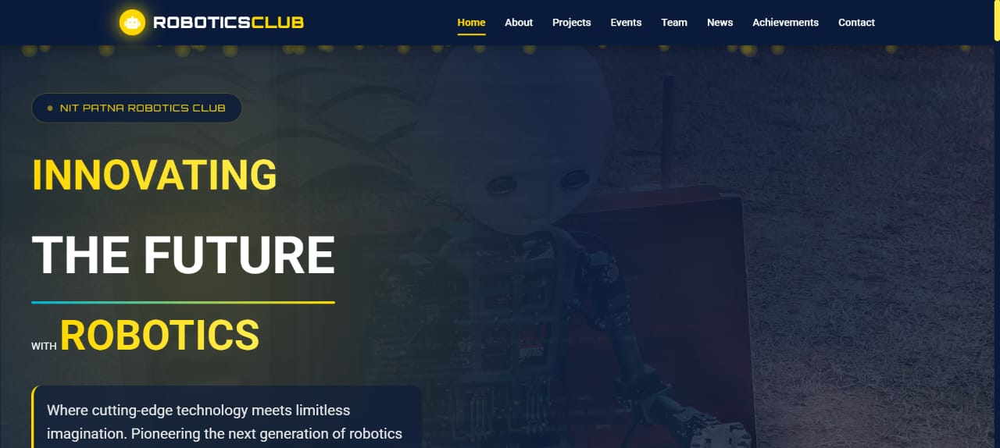
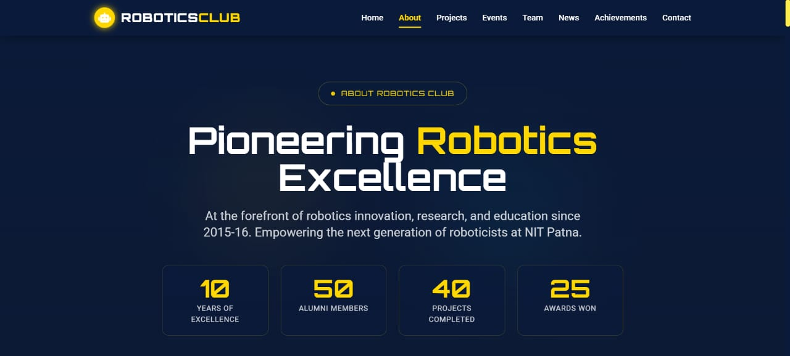
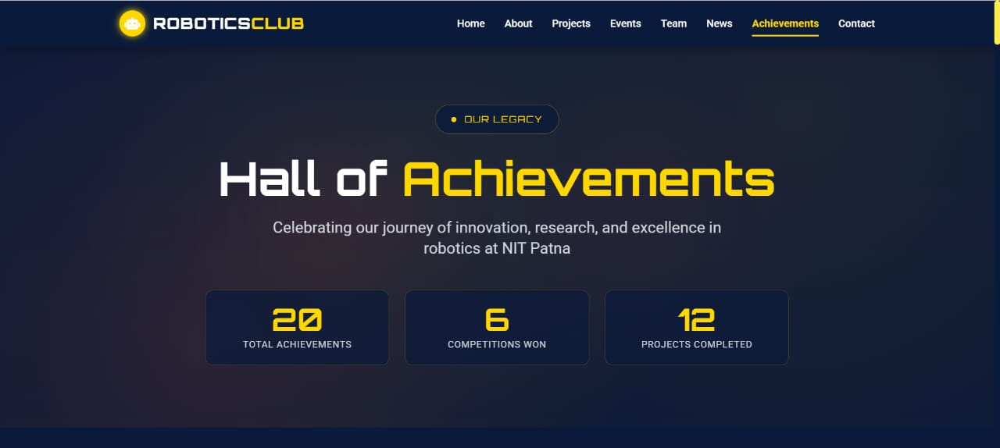

# 🤖 Robotics Club Website – NIT Patna

A responsive **frontend website** developed for the **Robotics Club – Web Development Task (AY 2025–26)**.

This project is designed to serve as a **simple, scalable, maintainable, and visually consistent** website for the Robotics Club, NIT Patna.

---

## ✨ Project Overview

- 📱 **Fully Responsive Design** across devices  
- 🧭 **Dynamically loaded Navbar & Footer** using JavaScript  
- 🎨 Consistent **robotics-themed color palette**
  - Primary: `#0a1a3a`
  - Accent: `#ffd700`
- 🧩 **Projects, Events, Team, News & Achievements pages**
  - Content added to page via JavaScript
  - Data sourced from structured JSON files
- 📊 Filterable content (year / category / event status)
- 🎞️ Smooth animations using:
  - Tailwind transitions  
  - Custom CSS animations  
  - JavaScript where required
- 📬 Contact page with frontend-only form (backend-ready)
- ♻️ Modular and maintainable CSS & JS architecture
- 🔍 **SEO-optimized**
  - Meta tags
  - Semantic HTML
  - Favicon support

---

## 🤖 Development Note

This project was developed with **responsible and positive use of AI tools** to:

- Improve code quality  
- Refine UI/UX decisions  
- Optimize structure and documentation  

All logic, structure, and final implementation decisions were **human-reviewed and customized**.

---

## 📄 Pages Implemented

1. Home  
2. About  
3. Projects  
4. Events  
5. Team  
6. News  
7. Achievements  
8. Contact

---

## 🛠️ Tech Stack

### Core Technologies

- **HTML** – Semantic and accessible structure  
- **Tailwind CSS (CDN)** – Utility-first responsive design  
- **CSS** – Custom components and layout styling  
- **Vanilla JavaScript** – Dynamic rendering and interactivity  
- **JSON** – Centralized data management  

### Why this stack?

- Lightweight & fast  
- Easy to maintain and scale  
- No framework lock-in  
- Good for future backend or API integration  

---

## 🧱 Technical Implementation

- **Navbar & Footer**
  - Loaded dynamically using JavaScript for reusability
- **JavaScript Architecture**
  - Separate JS files per page / feature
  - Clear separation of concerns
- **Data Handling**
  - JSON files used for:
    - Projects  
    - Events  
    - Team  
    - News  
    - Achievements
  - All cards rendered dynamically via JavaScript
- **Styling**
  - Tailwind for layout & responsiveness
  - Custom CSS for components and animations
- **Accessibility**
  - Semantic HTML tags
  - Alt attributes
  - Structured heading hierarchy

---

## 🚀 Deployment

- ✅ Deployed on **GitHub Pages / Vercel**
- 🌐 Compatible with modern browsers
- 📱 Mobile-first responsive approach  

---

## 🌟 Why This Project Stands Out

Unlike many typical frontend submissions, this project focuses not only on visual appeal but also on **engineering discipline, scalability, and real-world readiness**.

- 🧩 **Dynamic, Data-Driven Architecture**  
  Most pages are rendered fully using JavaScript and JSON instead of static HTML, closely simulating how real production websites consume API data.

- ♻️ **Reusable & Modular Design** 
  Common components like the navbar and footer are dynamically loaded, eliminating redundancy and improving maintainability.

- 🎯 **Framework-Independent & Lightweight**  
  Built without heavy frameworks, ensuring fast load times, better performance, and easier long-term maintenance.

- 🎨 **Consistent Robotics-Themed Identity**  
  A fixed color palette and visual language reflect the club’s technical and professional identity across all pages.

- 🔍 **SEO & Accessibility Awareness**  
  Use of semantic HTML, meta tags, favicon, and structured content improves discoverability and usability.

- 🧠 **Clean Code & Separation of Concerns**  
  Page-wise JavaScript files, dedicated JSON data sources, and structured CSS promote readability and scalability.

- 🤖 **Responsible Use of AI Tools**  
  AI was used as a productivity aid for refinement and optimization, while all architectural and implementation decisions were manually reviewed and customized.

## 👥 Contributors

- **Abhinav Srivastava**  
- **Kush Kumar**  
- **Saurabh Chaurasia**

---

## 🖼️ Screenshots

---

## 📜 Disclaimer

This project is created **for educational and evaluation purposes** as part of the  
**Robotics Club NIT Patna – Web Development Task (AY 2025–26)**.
